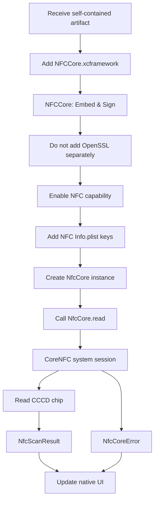
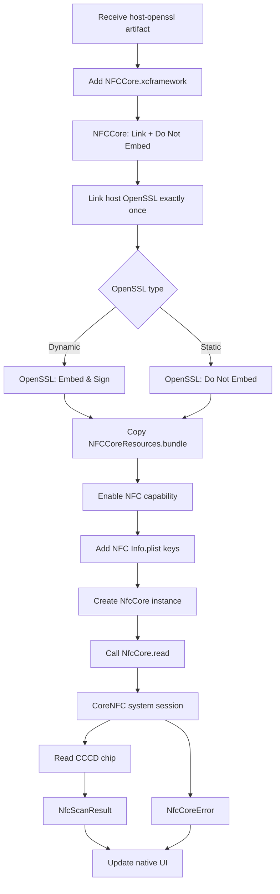
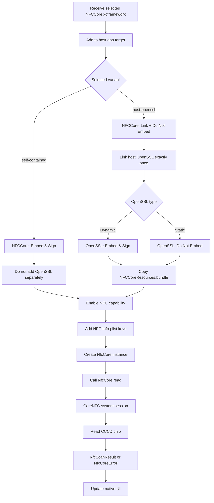

# iOS Host App Integration

## 1. Scope

This document is for the application team integrating the prebuilt iOS
`NFCCore` Library. It covers package selection, direct Xcode integration,
public API usage and NFC permissions.

The Library exposes the same Swift module in both delivery variants:

```swift
import NFCCore
```

Use exactly one variant in each application target.

## 2. Select the delivered artifact

| Host application state | Artifact to integrate | NFCCore setting | OpenSSL responsibility |
| --- | --- | --- | --- |
| Host does not have a compatible OpenSSL | `self-contained/NFCCore.xcframework` | Dynamic, **Embed & Sign** | Included privately by NFCCore |
| Host already has compatible OpenSSL | `host-openssl/NFCCore.xcframework` | Static, **Do Not Embed** | Host application |

The `host-openssl` package does not contain `OpenSSL.framework`, `libssl`, or
`libcrypto`. The host must use the compatible OpenSSL dependency for which the
artifact was prepared.

For Library `1.0.0`, the delivered `host-openssl` artifact is built and
smoke-tested with the dynamic framework module `OpenSSL` from
`com.github.krzyzanowskim.OpenSSL` version `1.1.2300`. A different provider or
version must expose the same `OpenSSL` module and required symbols, then be
validated by the Library provider before production use.

Never add `self-contained` and `host-openssl` to the same target.

## 3. Integration flow

### 3.1 Host app does not have OpenSSL



### 3.2 Host app already has OpenSSL



## 4. Direct XCFramework integration

1. Extract the delivered artifact.
2. Drag `NFCCore.xcframework` into the host application target.
3. Select the correct **Embed & Sign** or **Do Not Embed** setting from the
   artifact table above.
4. If using `host-openssl`, add `NFCCoreResources.bundle` to **Copy Bundle
   Resources**.
5. Link the host's OpenSSL exactly once when using `host-openssl`.

### Direct XCFramework integration flow



The final host app must not contain two NFCCore variants or two OpenSSL
providers for the same target.

## 5. OpenSSL linkage rules

`Link` and `Embed` have different meanings:

```text
Link   = use library symbols when the application is linked
Embed  = copy a dynamic framework into App.app/Frameworks for runtime
```

For the `host-openssl` artifact:

| Component | Host OpenSSL is dynamic | Host OpenSSL is static |
| --- | --- | --- |
| `NFCCore.xcframework` | Link, Do Not Embed | Link, Do Not Embed |
| `OpenSSL` | Link, Embed & Sign | Link, Do Not Embed |
| `NFCCoreResources.bundle` | Copy Bundle Resources | Copy Bundle Resources |

Dynamic and static OpenSSL are alternatives, not two dependencies to add
together. `Do Not Embed` for a static framework does not mean “do not link”.

## 6. Public API

### 6.1 Read a chip

`read` is asynchronous and should be called from the main actor because
CoreNFC owns a system UI session.

```swift
import NFCCore

let nfcCore = NfcCore()

Task { @MainActor in
  do {
    let result = try await nfcCore.read(
      request: NfcScanRequest(
        citizenId: citizenId,
        readImage: true,
        cachePolicy: .fresh,
        language: "vi"
      ),
      progressListener: { progress, message in
        // Update host UI only; keep this callback lightweight.
        print("NFC progress: \(progress)% - \(message)")
      }
    )

    print(result.fullName)
    print(result.dg1DataB64)
  } catch let error as NfcCoreError {
    let payload = error.payload
    print("NFC failed: \(payload.code) - \(payload.message)")
  } catch {
    print("Unexpected NFC error: \(error.localizedDescription)")
  }
}
```

### 6.2 Request fields

| Field | Required | Description |
| --- | --- | --- |
| `citizenId` | Yes | Citizen ID; the final six characters are used as CAN |
| `readImage` | No | Reads DG2 portrait; default is `true` |
| `cachePolicy` | No | `.fresh` or `.reuseIfValid`; default is `.fresh` |
| `language` | No | Progress/error language; default is `en` |

The input ID is trimmed. An ID shorter than six characters returns
`InvalidCitizenId` before the NFC session starts.

### 6.3 Progress callback

```swift
typealias NfcProgressListener = (_ progress: Int, _ message: String) -> Void
```

Progress is monotonic and ranges from `0...100`. Do not start another NFC
operation or perform blocking work inside this callback.

### 6.4 Clear cached portrait data

```swift
NfcCore.clearCachedScan()
```

This clears only the Library's short-lived in-memory DG2 portrait cache.

### 6.5 Result fields

Text fields:

```text
citizenId, fullName, dob, gender, nationality
permanentAddress, issueDate, issuePlace, expireDate
```

Native binary fields remain `Data`:

```text
imageFromChipData, dg1Data, dg2Data, dg13Data, dg14Data, sodData
```

Encoded convenience properties:

```text
imageFromChip, imageFace
dg1DataB64, dg2DataB64, dg13DataB64, dg14DataB64
sodDataB64, sodDataBase64
```

`liveFaceImage`, `frontCardFileId` and `backCardFileId` are empty because they
belong to a host liveness/card-upload flow. `passiveAuth` and `chipAuth` are
`false` in the current public result contract.

### 6.6 Error handling

Branch on `NfcCoreError.payload.code`, not localized message text.

| Code | Meaning |
| --- | --- |
| `InvalidCitizenId` | Input ID is invalid or shorter than six characters |
| `NFCNotSupported` | Device does not support NFC |
| `UserCanceled` | User canceled the CoreNFC session |
| `SessionTimeout` | NFC session timed out |
| Other read code | Reader or card error |

Payload shape:

```json
{
  "code": "UserCanceled",
  "message": "NFC session was canceled"
}
```

## 7. NFC permissions and entitlements

### 7.1 Signing & Capabilities

Enable **Near Field Communication Tag Reading** for the host app target. The
target entitlement must contain:

```xml
<key>com.apple.developer.nfc.readersession.formats</key>
<array>
    <string>TAG</string>
</array>
```

Refresh the provisioning profile after enabling the capability.

### 7.2 NFC Info.plist

Add the NFC usage description:

```xml
<key>NFCReaderUsageDescription</key>
<string>Ứng dụng sử dụng NFC để đọc dữ liệu từ thẻ căn cước công dân gắn chip.</string>
```

Add the ISO7816 identifiers required by the card:

```xml
<key>com.apple.developer.nfc.readersession.iso7816.select-identifiers</key>
<array>
    <string>A0000002471001</string>
    <string>A0000002472001</string>
    <string>00000000000000</string>
</array>
```

These keys must be present in the actual host app target's `Info.plist`, not
only in a test target.

### 7.3 Device requirements

- Test NFC on a physical iPhone.
- The device must support CoreNFC.
- The provisioning profile must include NFC Tag Reading.
- The simulator validates compilation and linking only.

## 8. Integration checklist

- [ ] Only one NFCCore variant is selected.
- [ ] The OpenSSL mode matches the delivered artifact.
- [ ] `NFCCoreResources.bundle` is copied for `host-openssl`.
- [ ] NFC Tag Reading capability is enabled.
- [ ] NFC entitlement and ISO7816 identifiers are present.
- [ ] `NFCReaderUsageDescription` is present.
- [ ] The host handles `NfcCoreError.payload.code`.
- [ ] NFC is tested on a physical iPhone.
